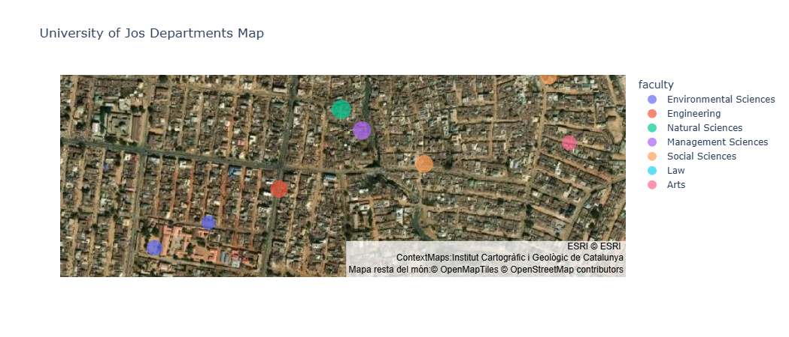
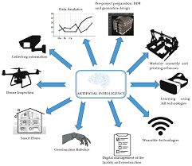

<!-- ===================== HERO / ANIMATED BANNER ===================== -->

  <!-- Replace `assets/banner.gif` with your uploaded banner GIF (1200x300 recommended) -->
  

<!-- ===================== TYPING INTRO ===================== -->
<h1 align="center">👋 Hi — I'm Jeremiah Hemben</h1>

  

  <em style="font-size:16px;">
    Fusing intelligence with innovation — I explore the synergy of AI, Machine Learning, and Data Science to uncover insights, build smarter systems, and shape the next generation of technology.
  </em>

---

<!-- ===================== QUICK BADGES ===================== -->

  
  
  
  
  
  
  
  

---

<!-- ===================== ABOUT + AVATAR ===================== -->

  <!-- Replace `assets/avatar.gif` with a small avatar GIF (120x120) for animation; if none, use a static PNG -->
  
  
    I turn data into decisions — building ML pipelines, dashboards, and reproducible analytics for real-world impact.
  

---

## ✨ What I do
- Design and implement ML pipelines for prediction, classification, and forecasting.  
- Build interactive visualizations & dashboards with Plotly, Streamlit and Dash.  
- Apply explainability (SHAP / LIME) and robust validation for trustworthy models.  
- Explore AI applications for construction, sustainability, and smart-city analytics.

---

## 🚀 Featured Projects

| Project | Preview | Short description |
|-------:|:-------:|:------------------|
| **House Price Predictor** |  | Regression pipeline, EDA, feature engineering, SHAP explainability, deployed with Streamlit. |
| **University Dashboard** |  | Interactive Plotly dashboard for departmental analytics and visual storytelling. |
| **AI Construction Analytics** |  | Cost estimation & sustainability forecasting using ML experiments and notebooks. |

---

## 📊 Live GitHub Stats & Activity

  <!-- GitHub Readme Stats — shows languages, stars, etc. -->
  

  <!-- Top languages card -->
  

  <!-- Visitor counter -->
  

---

## 🧰 Tech Stack & Tools

  &nbsp;
  &nbsp;
  &nbsp;
  &nbsp;
  &nbsp;
  &nbsp;
  &nbsp;
  

---

## 🧭 Learning Roadmap
- ✅ Python for Data Science — NumPy, Pandas  
- ✅ Exploratory Data Analysis & Visualization — Matplotlib, Plotly  
- 🔄 Machine Learning — Scikit-learn, model tuning, cross-validation  
- 🔜 Deep Learning — TensorFlow, Keras (CNNs, Transformers)  
- 🔜 Model Deployment & MLOps — Streamlit, FastAPI, Docker, GitHub Actions

---

## 📫 Connect with me

  
  &nbsp;
  
  &nbsp;
  
  &nbsp;
  

---

## 🔗 Quick Links
- 🔭 Projects: (pin your top 4 in profile)  
- 📝 Blog / Articles: *(add link if you have one)*  
- 🧾 Resume: *(add link if you want to display it)*

---

<!-- ===================== FOOTER WAVE (SVG) ===================== -->

  

  Made with 💡 • AI • Machine Learning • Data Science — <strong>HembenDev</strong>

<!-- 🐍 Contribution Snake -->
<picture>
  <source media="(prefers-color-scheme: dark)" srcset="https://raw.githubusercontent.com/HembenDev/HembenDev/output/github-snake-dark.svg" />
  <source media="(prefers-color-scheme: light)" srcset="https://raw.githubusercontent.com/HembenDev/HembenDev/output/github-snake.svg" />
  
</picture>

